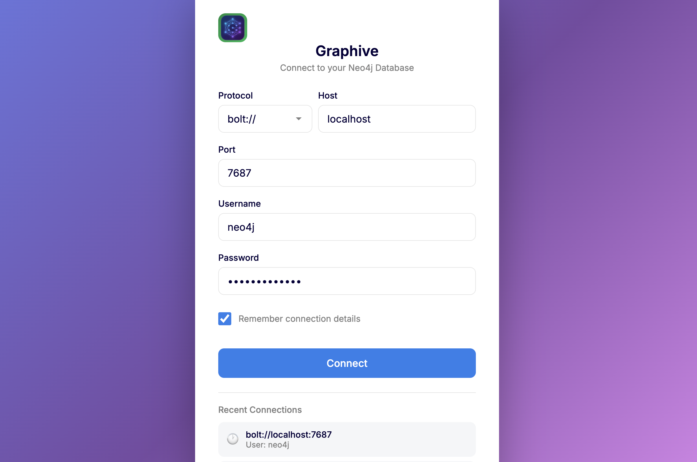
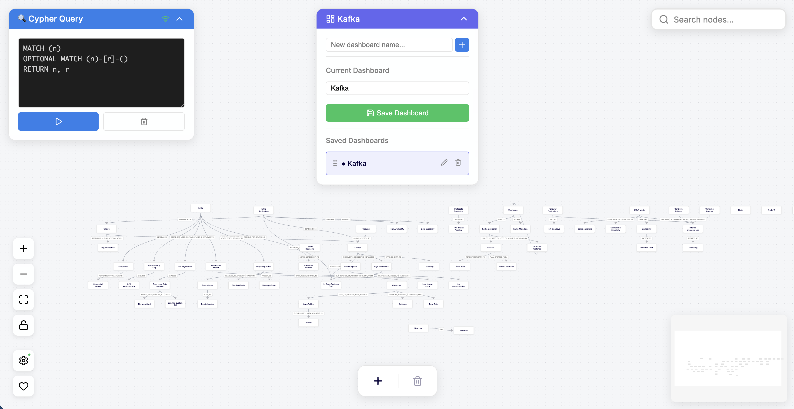

<p align="center">
  
  <h1 align="center">Graphive</h1>
</p>

<p align="center">
  
  
  
  
  
  <a href="https://ko-fi.com/charlesnguyen" target="_blank"></a>
</p>

<p align="center">
  <strong>The structured, visual editor for Neo4j and FalkorDB.</strong>
  <br>
  Built with React Flow to bring clarity to your graph data.
</p>

<br>

## 🖼️ Screenshots

<p align="center">
  
</p>

<p align="center">
  
</p>

<br>

## 🌟 Intuitive Creation, Mindmap Feel

Graphive is designed with a **Miro-like intuition** and a **mindmap-like flow**.

While traditional graph explorers are often complex and read-only, Graphive is a developer's canvas. It focuses on the **ease of creation and connection**, making graph data exploration feel as fluid as a digital whiteboarding tool.

*   **⚡ Effortless Interaction**: Display, add, and connect nodes and edges with simple, tactile interactions.
*   **🧠 Mindmap Likeness**: Visualize your graph with the natural feel of a mindmap, keeping your cognitive load low.
*   **🖌️ Miro-like Ease**: A premium, responsive interface that turns data exploration into a creative process.
*   **🏗️ Build, Don't Just Browse**: Seamlessly edit properties and labels on the fly to evolve your graph as you think.
*   **🚀 Multi-Database Support**: First-class support for both Neo4j and FalkorDB.

### 🛣️ Roadmap: Force-Directed Layouts
Graphive started as a personal tool for building a **Personal Knowledge Base (PKB)**. Because I prefer a mindmap-style flow for my own research and thinking, I prioritized polished **Hierarchical Views** first. 

**Force-Directed Layouts** (organic views) are officially on the roadmap and will be added as the project evolves!

<br>

## 🛠️ Tech Stack

Built with a modern, performance-first stack:

*   **[React Flow](https://reactflow.dev/)**: The powerful, customizable library powering our node-based UI.
*   **[Neo4j](https://neo4j.com/)**: Connecting directly to the leading graph database via the Bolt driver.
*   **[FalkorDB](https://www.falkordb.com/)**: High-performance graph database built on Redis.
*   **[Vite](https://vitejs.dev/)**: Ensuring a lightning-fast development experience and optimized builds.

<br>

## ✨ Key Features

*   **🏗️ Structured Auto-Layout**: Automatically arranges nodes in clear hierarchies (DAGre/Tree).
*   **💾 Dashboard System**: Create distinct workspaces. Save your exploration state (nodes, positions, query) and restore them instantly.
*   **🖍️ Visual Editing**: Rename nodes, edit properties, delete relationships, and manage labels directly on the canvas.
*   **🔍 Cypher Power**: Run custom Cypher queries and visualize specific subgraphs with one click.
*   **⚡ Auto-Connect**: Seamlessly explore relationships with interactive handles and context menus.

<br>

## 🚀 Quick Start

### Prerequisites
*   Node.js (v18+)
*   Running Database Instance (Neo4j or FalkorDB)

### Installation

1.  **Clone the repository**
    ```bash
    git clone https://github.com/charlesnguyenindie/graphive.git
    cd graphive
    ```

2.  **Install dependencies**
    ```bash
    npm install
    ```

3.  **Run the development server**
    ```bash
    npm run dev
    ```

4.  **Open Graphive**
    Navigate to `http://localhost:5173` in your browser.

<br>

---

## 🔗 Connecting to Neo4j

1.  Ensure your Neo4j instance is running with Bolt enabled.
2.  In Graphive, enter your connection details:
    *   **Protocol**: `bolt://` or `bolt+s://`
    *   **Host**: e.g., `localhost`
    *   **Port**: `7687` (default Bolt port)
    *   **Username**: Your Neo4j username
    *   **Password**: Your Neo4j password

<br>

---

## 🐳 Connecting to FalkorDB

### Running FalkorDB with Docker

Graphive has been developed and tested with FalkorDB running in Docker using the following command:

```bash
docker run -p 6379:6379 -p 3000:3000 -it --rm \
  -e REDIS_ARGS="--requirepass your_password" \
  falkordb/falkordb
```

This exposes:
*   **Port 6379**: Redis protocol (used by FalkorDB internally)
*   **Port 3000**: FalkorDB Browser API (required by Graphive)

### Connecting in Graphive

1.  In Graphive, select **FalkorDB** as your database type.
2.  Enter your connection details:
    *   **Protocol**: `http` (or `https` if using TLS)
    *   **Host**: `localhost`
    *   **Port**: `3000` (FalkorDB Browser API port)
    *   **Username**: `default` (or leave empty)
    *   **Password**: `your_password` (the one you set in the Docker command)

> ⚠️ **Important**: Graphive has only been tested with FalkorDB running in a Docker container using the exact command above. Other FalkorDB setups (e.g., standalone installations, cloud deployments) have not been verified yet.

<br>

---

## ❓ Why HTTP/HTTPS Instead of Redis Protocol?

Graphive connects to FalkorDB via its **Browser API (port 3000)**, not the Redis protocol (port 6379). Here's why:

1.  **Browser Compatibility**: Web browsers cannot directly connect to Redis sockets. The Redis protocol requires a native TCP connection, which is not available in browser JavaScript environments.

2.  **FalkorDB Browser API**: FalkorDB provides an HTTP-based Browser API on port 3000 that enables web applications like Graphive to communicate with the database using standard HTTP requests.

3.  **Security**: The HTTP layer allows for proper CORS handling and can be secured with HTTPS, making it suitable for browser-based applications.

This is why **port 3000 must be exposed** when running FalkorDB in Docker for Graphive to function.

<br>

---

## 💖 Support & Donation

If you find Graphive helpful and want to support its development, you can buy me a coffee!

<a href="https://ko-fi.com/charlesnguyen" target="_blank"></a>

<br>

## 📬 Contact

Have questions, suggestions, or want to collaborate? Feel free to reach out!

*   **Email**: [charles.nguyen.indie@gmail.com](mailto:charles.nguyen.indie@gmail.com)

<br>

## 📄 License

Distributed under the MIT License. See `LICENSE` for more information.
